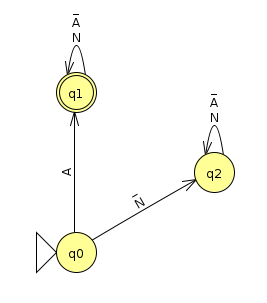
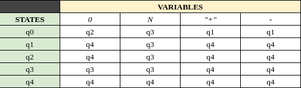
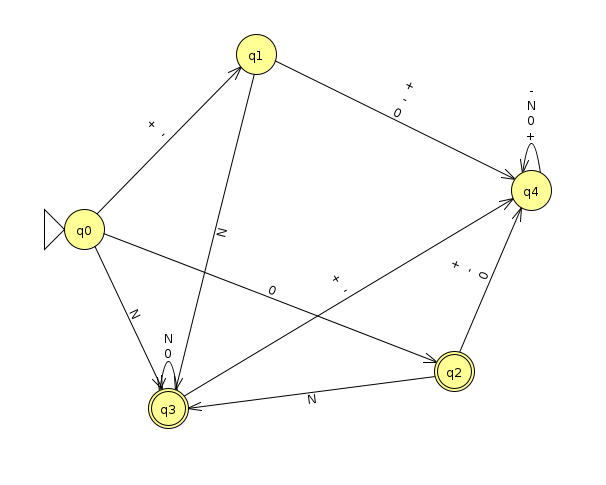
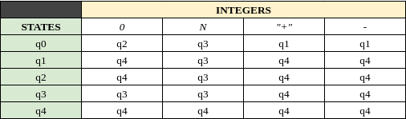
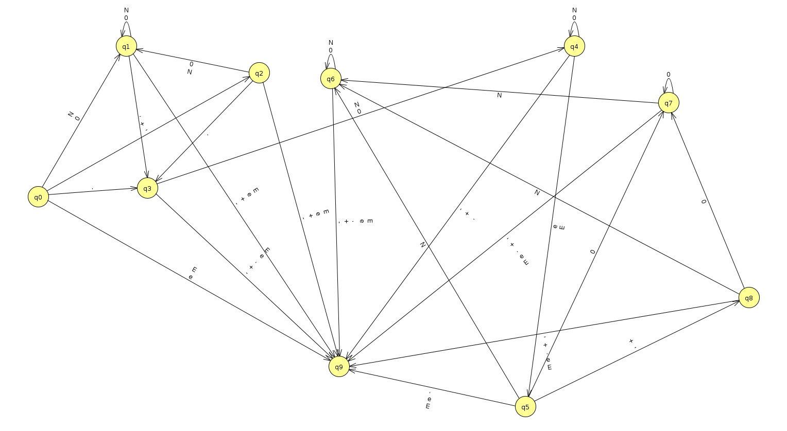
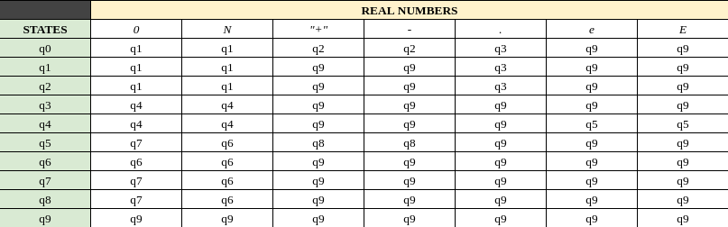

# Activity 3.2: _Programming a DFA_

## Requirements
* Computer with python interpreter (python3 is preferable)
* Python version 3.7.0 or higher

## Usage
* Execute the `main.py` file with python3 and passing as an argument the path (relative or absolute) to a test file
```
  python3 main.py <path-to-file>
```

## The Approach
One automaton was designed for each major token type (variables, real numbers and integers), this automatons are represented as instances of a `DFA` class. 
For single characters, a child class `OneCharacterDFA` was created.

```
  class DFA:
    ...

  class OneCharacterDFA(DFA):
    ...
```

Transition tables in the code are represented as a dictionary of dictionaries
```
    "INTEGERS": {
        "q0": { "0": "q2", "N": "q3", "+": "q1", "-": "q1" },
        "q1": { "0": "q4", "N": "q3", "+": "q4", "-": "q4" },
        "q2": { "0": "q4", "N": "q3", "+": "q4", "-": "q4" },
        "q3": { "0": "q3", "N": "q3", "+": "q4", "-": "q4" },
        "q4": { "0": "q4", "N": "q4", "+": "q4", "-": "q4" },
    }, 
```

### Automatons and transition tables
1. Variables



2. Integers



3. Real numbers

 


## Credits
- Author: <a href="https://www.linkedin.com/in/carloscrodriguezg/" target="_blank">Carlos César Rodríguez</a>

